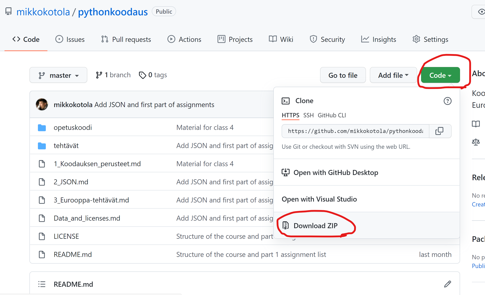

# Ohje: tietojen hakeminen ja Visual Studio Code

## Hae tiedot
- Tätä ja seuraavaa osiota varten tarvitsemme tiedostoja. Seuraa näitä ohjeita:
    1. Mene selaimella osoitteeseen https://github.com/mikkokotola/pythonkoodaus
    2. Paina vihreää nappia "Code" ja sitten "Download ZIP"
    
    
    3. Tallenna tiedosto koneellesi oletuskansioon 
    4. Avaa tiedostonhallinta, ja mene tuohon samaan kansioon
    5. Paina tiedoston nimen päällä hiiren oikeaa nappia, ja valitse "Pura kaikki"

## Avaa koodieditori Visual Studio Code
1. Avaa koneellasi ohjelma "Visual Studio Code" (paina näytön vasemmasta alakulmasta ikkuna-symbolia ja ala kirjoittaa "visual", niin näet Visual Studio Coden)
2. Visual Studio Codessa: Valitse ylävalikosta "File" ja sen alta "Open Folder"
3. Valitse kansio "tehtävät" lataamasi kansion alta

## Koodin ajaminen ja debuggaaminen Visual Studio Codessa
1. Avaa haluamasi kooditiedosto (kooditiedostot ovat muotoa .py), esimerkiksi E1.1_listat.py, tuplaklikkaamalla sitä vasemmassa reunassa. Tiedosto avautuu päänäkymään.
2. Yritä asettaa punainen pysäytyspiste (breakpoint) klikkaamalla hiiren vasemmalla napilla rivinumeron vasemmalla puolella (ks. kuva). Jos et saa asetettua pysäytyspistettä, tarkasta, että Visual Studio Coden lisäosa (plug-in) "Python" on asennettu (ks. ohje alla)
.
3. Paina oikeassa yläkulmassa olevaan nuolisymbolin vieressä olevaa nuolta alaspäin. Valitse "Debug Python File in Terminal". Kooditiedoston suoritus käynnistyy (näet tekstiä alareunassa olevassa konsolissa). Suoritus pysähtyy asettamaasi pysäytyspisteeseen (näet keltaisen nuolen, joka osoittaa kyseistä riviä). Näet vasemmassa reunassa muuttujien nykyiset arvot.
. Alareunan konsolissa näkyvät ohjelman tulosteet (output).
4. Etene rivi riviltä painalla F10 tai "Step over"-nappia yläreunassa (toinen nappi)
5. Voit jatkaa ohjelman suoritusta painalla F5 tai "Continue"-nappia yläreunassa (ensimmäinen nappi) 
6. Voit lopettaa ohjelman suorituksen painalla "Stop"-nappia yläreunassa (punainen neliö)

## Tarkasta että Visual Studio Coden lisäosa (plug-in) "Python" on asennettu

1. Klikkaa vasemmassa reunassa symbolia, jossa on neljä laatikkoa.
2. Kirjoita avautuvaan hakulaatikkoon "python"
3. Tarkasta että ylimpänä näkyvässä "Python"-lisäosassa (julkaisija Microsoft) ei ole "Install" nappia. Jos "Install"-nappia ei näy, lisäosa on jo asennettu. Jos nappi näkyy, paina sitä, ja lisäosa asentuu. Voit sulkea asennuksen jälkeen avautuvan ikkunan.